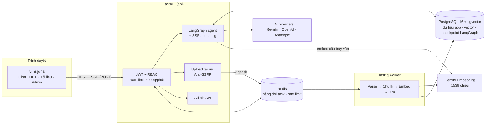
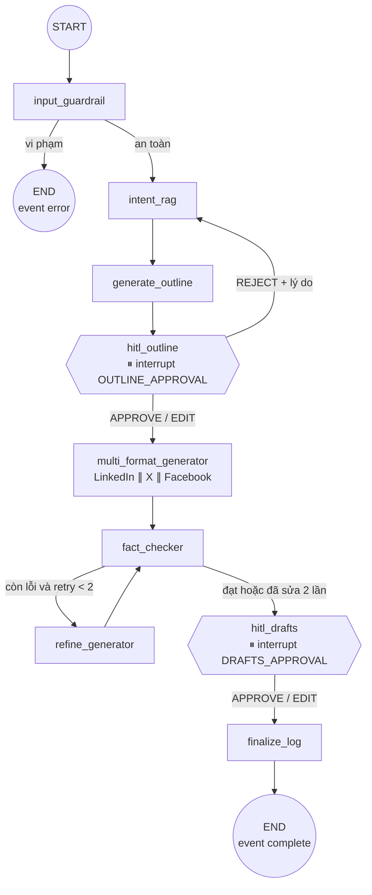
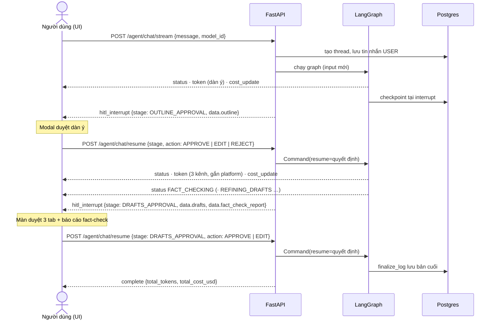
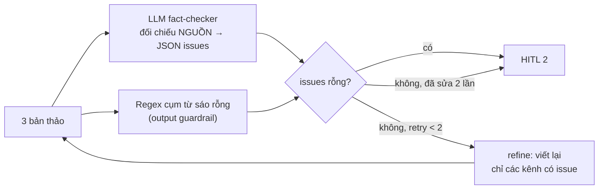
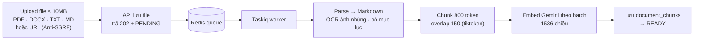
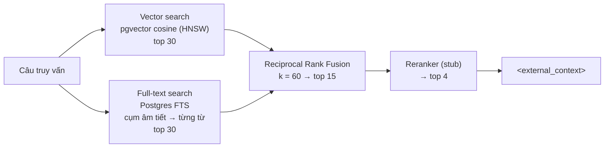

# Báo cáo dự án – Marketing Agent MVP

| | |
|---|---|
| **Sản phẩm** | Agent AI lên chiến dịch truyền thông đa kênh (LinkedIn, X, Facebook) có người duyệt ở các bước quan trọng |
| **Thời gian** | 5 ngày (theo [PLAN_5_DAYS.md](PLAN_5_DAYS.md)) |
| **Spec gốc** | [spec_marketing_agent.md](spec_marketing_agent.md) |
| **Trạng thái** | Chạy được end-to-end từ UI; backend 82 test tự động; chạy bằng Docker Compose |

---

## 1. Tóm tắt

Người dùng nhập một brief (vd. *"Ra mắt ứng dụng PayNow cho kế toán SME, mục tiêu 500 lead tháng 11"*). Agent:

1. kiểm tra an toàn nội dung và che thông tin cá nhân,
2. tra cứu tài liệu nội bộ (RAG) mà người dùng / admin đã tải lên,
3. soạn **dàn ý chiến dịch** → **dừng chờ người duyệt** (duyệt / sửa / từ chối kèm lý do),
4. viết song song **3 bản thảo** LinkedIn, X thread, Facebook,
5. **fact-check** bản thảo với nguồn, tự sửa tối đa 2 vòng,
6. **dừng chờ người duyệt** bộ bản thảo (duyệt / sửa từng kênh),
7. lưu bản cuối; mọi lần gọi LLM đều được ghi **token và chi phí USD**.

Toàn bộ nội dung được **stream realtime** về giao diện (SSE). Admin quản lý người dùng, bảng giá model và xem báo cáo chi phí.

**Kết quả so với mục tiêu ngày 5** – *"demo được toàn bộ luồng từ UI; README chạy lại từ đầu thành công"*: đạt. Đã kiểm chứng bằng trình duyệt tự động (Chrome headless) với LLM thật (Gemini) trên cả bản dev và bản build Docker.

---

## 2. Kiến trúc tổng thể



| Thành phần | Công nghệ | Vai trò |
|---|---|---|
| Frontend | Next.js 16 (App Router), React 19, Tailwind 4, `@microsoft/fetch-event-source` | UI chat stream, modal duyệt, admin |
| Backend | FastAPI, SQLAlchemy 2 (async), Alembic, Pydantic v2 | REST + SSE, auth, nghiệp vụ |
| Agent | LangGraph 1.x, LangChain Core, `AsyncPostgresSaver` | Đồ thị agent, interrupt/resume HITL |
| RAG | PyMuPDF (+ Tesseract OCR), python-docx, BeautifulSoup, tiktoken, Gemini Embedding, pgvector HNSW + Postgres FTS | Ingest và hybrid retrieval |
| Hàng đợi | Taskiq + Redis | Ingest tài liệu nền |
| Hạ tầng | Docker Compose (Postgres 5434, Redis 6380, API 8010, Web 3010) | Chạy local / demo |

---

## 3. Luồng chạy của agent

### 3.1. Đồ thị LangGraph



Định nghĩa: [backend/app/agent/graph.py](../backend/app/agent/graph.py). State lưu bằng checkpointer Postgres theo `thread_id`, nên graph có thể **dừng ở interrupt và chạy tiếp ở một request HTTP khác** (kể cả sau khi restart server).

### 3.2. Các node

| Node | Việc làm | Gọi LLM | Stream token | Status SSE |
|---|---|---|---|---|
| `input_guardrail` | Regex jailbreak EN/VI + classifier (stub); che PII (email, SĐT, CCCD, số thẻ có Luhn) trong brief | – | – | `INPUT_GUARDRAIL` |
| `intent_rag` | Hybrid retrieval top 4 chunk theo brief (+ lý do reject nếu có); lỗi RAG không chặn luồng | – (chỉ embed query) | – | `RAG_RETRIEVAL` |
| `generate_outline` | Soạn dàn ý Markdown từ brief + tài liệu; nếu bị reject thì nhận dàn ý cũ + phản hồi | ✓ | ✓ | `GENERATING_OUTLINE` |
| `hitl_outline` | `interrupt()` chờ người duyệt; xử lý APPROVE / EDIT (thay dàn ý) / REJECT (che PII trong lý do, quay lại RAG) | – | – | – |
| `multi_format_generator` | Viết 3 bản thảo song song (`asyncio.gather`), mỗi kênh có luật riêng; che secret lọt ra | ✓ ×3 | ✓ (gắn `platform`) | `GENERATING_DRAFTS` |
| `fact_checker` | LLM đối soát bản thảo với NGUỒN (trả JSON) + regex phát hiện cụm từ sáo rỗng; `passed` = không còn issue | ✓ | – (JSON nội bộ) | `FACT_CHECKING` |
| `refine_generator` | Viết lại **chỉ các kênh bị nêu lỗi**, tăng `retry_count` | ✓ ×≤3 | ✓ (gắn `platform`) | `REFINING_DRAFTS` |
| `hitl_drafts` | `interrupt()` chờ người duyệt; EDIT chỉ nhận các kênh hợp lệ | – | – | – |
| `finalize_log` | Lưu bộ bản thảo cuối vào `thread_messages` | – | – | `FINALIZING` |

### 3.3. State của agent (`AgentState`)

| Nhóm | Field |
|---|---|
| Định danh | `thread_id`, `user_id`, `selected_model`, `messages` |
| Brief & RAG | `campaign_topic` (đã che PII), `retrieved_rag_context`, `web_search_context` *(chưa dùng)*, `guardrail_violation` |
| HITL 1 | `outline`, `outline_status` (approved / edited / rejected), `outline_feedback` |
| Bản thảo | `drafts` = `{linkedin, twitter, facebook}` |
| Fact-check | `fact_check_passed`, `fact_check_report` (`passed`, `summary`, `issues[]`, `round`), `retry_count` |
| HITL 2 | `drafts_status` |

### 3.4. Một phiên đầy đủ: 3 request HTTP



Quy ước stream ([streaming.py](../backend/app/agent/streaming.py)): mỗi lượt **luôn kết thúc bằng đúng một** trong `hitl_interrupt` / `error` / `complete`.

| Event | Dữ liệu chính | UI dùng để |
|---|---|---|
| `status` | `step`, `message` (lượt đầu kèm `thread_id`) | Thanh tiến trình các bước |
| `token` | `node`, `token`, `platform?` | Hiện chữ đang sinh, tách theo kênh |
| `cost_update` | `node`, `model_id`, token vào/ra, `cost_usd`, `pricing_missing` | Cộng dồn thanh chi phí |
| `hitl_interrupt` | `stage`, `message`, `data` | Mở modal / màn duyệt |
| `error` | `code`, `message` | Báo lỗi |
| `complete` | `total_tokens`, `total_cost_usd` của cả thread | Chốt tổng chi phí |

Các ràng buộc khi resume ([agent.py](../backend/app/api/v1/agent.py)):

- Thread phải thuộc user, và đang dừng đúng `stage` gửi lên (sai → 409).
- Gửi brief mới khi thread đang chờ duyệt → 409.
- `EDIT` dàn ý bắt buộc có `updated_outline`; `EDIT` bản thảo bắt buộc có `updated_drafts` và chỉ nhận 3 kênh hợp lệ; `REJECT` chỉ áp dụng cho dàn ý.
- Nội dung sửa / lý do reject cũng đi qua bộ lọc jailbreak.

### 3.5. Vòng fact-check và tự sửa



- **NGUỒN** gồm brief, dàn ý đã duyệt và tài liệu RAG trong thẻ `<external_context>`.
- Issue có 2 loại: `fact` (khẳng định không có căn cứ) và `cliche` (cụm sáo rỗng kiểu AI).
- Nếu output của fact-checker không đọc được JSON, hệ thống ghi chú *"cần kiểm tra thủ công"* thay vì làm hỏng luồng.
- Báo cáo (kể cả các issue còn lại sau 2 vòng) được đưa lên màn duyệt để người dùng quyết định.

### 3.6. Ba lớp guardrail

| Lớp | Ở đâu | Cơ chế |
|---|---|---|
| **Đầu vào** | API + `input_guardrail` | Rate limit 30 req/phút/user (Redis); regex jailbreak / prompt injection (EN + VI, chặn cả thẻ giả mạo `<system>`, `<external_context>`); classifier ngữ nghĩa *(stub)*; che PII trước khi gửi LLM |
| **Cách ly ngữ cảnh** | Prompt | Tài liệu ngoài luôn bọc trong `<external_context>`, xóa thẻ giả mạo bên trong; system prompt yêu cầu coi đó là DỮ LIỆU, không làm theo chỉ thị trong đó; không bịa số liệu, thiếu thì ghi `[cần bổ sung số liệu]` |
| **Đầu ra** | Generator + fact-checker | Che secret (API key, private key, JWT, token GitHub/Slack/AWS, mật khẩu) bằng `[REDACTED]`; phát hiện cụm sáo rỗng để đưa vào vòng sửa |

### 3.7. Theo dõi chi phí (cost audit)

- Mỗi event `on_chat_model_end` của LangGraph → đọc `usage_metadata` → ghi **1 dòng `llm_cost_logs`** (user, thread, node, model, token vào/ra, USD) → phát `cost_update`.
- Giá tính theo `model_pricing` (USD / 1K token, admin sửa được). Model không có giá vẫn ghi token, chi phí 0 và cờ `pricing_missing` để UI cảnh báo.
- Event `complete` mang tổng của cả thread; mở lại thread cũng khôi phục tổng qua `GET /agent/threads/{id}/state`.
- Admin xem tổng hợp theo **model / node / người dùng**, lọc theo ngày, user, model.

---

## 4. Luồng tài liệu RAG

### 4.1. Ingest (chạy nền)



- **Theo dõi tiến độ:** worker ghi `documents.ingest_progress` (trạng thái, done/total, thời điểm từng bước, heartbeat 5s). UI hiện 4 thanh tiến độ và cảnh báo khi: chưa có worker nhận task (> 20s), mất heartbeat worker (> 20s), hoặc một bước không tiến triển (> 45s). Khi lỗi, UI chỉ ra bước hỏng và nguyên nhân (vd. *"Lỗi ở bước Embed: 429 RESOURCE_EXHAUSTED"*).
- **Phân quyền:** `PRIVATE` (chỉ người tải lên) hoặc `SYSTEM` (mọi user, chỉ ADMIN được tải). Admin xóa được mọi tài liệu (chunk xóa theo cascade, file xóa khỏi đĩa).
- **Anti-SSRF** cho URL: chỉ http/https, chỉ cho phép IP công khai (chặn mạng nội bộ, loopback, link-local như `169.254.169.254`, multicast); mỗi lần redirect đều resolve DNS và kiểm tra lại; giới hạn dung lượng và timeout.

### 4.2. Truy xuất (hybrid retrieval)



- Chỉ lấy chunk của tài liệu `READY` và thuộc phạm vi của user (`SYSTEM` hoặc `PRIVATE` của chính họ); bật `hnsw.iterative_scan` để lọc phạm vi không làm hụt kết quả.
- FTS tối ưu cho tiếng Việt: tìm theo cặp âm tiết liền nhau (`nghỉ <-> việc`) trước, không khớp mới tìm từng từ.

---

## 5. Cấu trúc dự án

```text
market_agent/
├── README.md                     Hướng dẫn chạy (Docker / dev), demo, test, API
├── docs/
│   ├── spec_marketing_agent.md   Spec gốc (kiến trúc, DB, API, FE guideline)
│   ├── PLAN_5_DAYS.md            Kế hoạch 5 ngày
│   ├── BAO_CAO_DU_AN.md          Báo cáo này
│   └── samples/                  Tài liệu mẫu để test RAG (PayNow Marketing Playbook, hư cấu)
├── docker-compose.yml            Cả stack: Postgres, Redis, api, worker, web
├── backend/
│   ├── Dockerfile                Python 3.13 + Tesseract; migrate + seed rồi chạy uvicorn
│   ├── pyproject.toml · alembic.ini · .env.example
│   ├── scripts/seed.py           Admin mặc định + bảng giá model (chạy lại an toàn)
│   ├── app/
│   │   ├── main.py               FastAPI app, CORS, lifespan (khởi tạo checkpointer, broker)
│   │   ├── core/                 config (pydantic-settings), logging, security (JWT, bcrypt)
│   │   ├── api/
│   │   │   ├── deps.py           get_current_user, require_admin
│   │   │   └── v1/               auth · agent (stream/resume/threads/models) · documents · admin
│   │   ├── agent/
│   │   │   ├── graph.py          StateGraph + điều kiện rẽ nhánh + compile với checkpointer
│   │   │   ├── state.py          AgentState, FactCheckReport, PLATFORMS, MAX_REFINES
│   │   │   ├── nodes/            9 node (bảng mục 3.2)
│   │   │   ├── prompts/          outline · generator · fact_checker · refine (.md) + external_context()
│   │   │   ├── streaming.py      astream_events → SSE, cost auditor, event kết thúc
│   │   │   ├── llm_factory.py    Chọn ChatOpenAI / ChatAnthropic / ChatGoogleGenerativeAI theo model_id
│   │   │   └── checkpointer.py   AsyncPostgresSaver (psycopg pool)
│   │   ├── rag/
│   │   │   ├── parsers.py        PDF/DOCX/TXT/HTML → Markdown, OCR, bỏ mục lục, báo tiến độ
│   │   │   ├── chunker.py        Đoạn → câu → cửa sổ token, giữ heading; 800/150 token
│   │   │   ├── embedder.py       Gemini embedding (cắt 1536 chiều)
│   │   │   ├── retriever.py      Vector + FTS + RRF
│   │   │   ├── reranker.py       Stub
│   │   │   └── progress.py       Theo dõi tiến độ ingest + heartbeat
│   │   ├── guardrails/           input_filter · pii · injection_classifier (stub) · output_scanner · rate_limiter · anti_ssrf
│   │   ├── services/             auth · chat (thread/message) · cost · pricing · document (upload, ingest)
│   │   ├── workers/              broker (Taskiq Redis / in-memory) · tasks (ingest_document)
│   │   ├── schemas/              Pydantic request/response
│   │   └── db/
│   │       ├── models/           users · model_pricing · documents · document_chunks · chat_threads · thread_messages · llm_cost_logs
│   │       └── migrations/       0001 schema ban đầu · 0002 ingest_progress
│   └── tests/
│       ├── conftest.py           LLM giả (ScriptedLLM), embedder giả, dọn dữ liệu test
│       ├── unit/                 guardrails, chunker, parsers, anti-SSRF, retrieval utils
│       └── integration/          auth, documents, agent (luồng 2 HITL), admin
└── frontend/
    ├── Dockerfile                Build standalone, nhúng NEXT_PUBLIC_API_URL
    ├── package.json · next.config.ts · tsconfig.json · .env.example
    └── src/
        ├── app/
        │   ├── login/            Đăng nhập / đăng ký
        │   ├── (user)/chat/      Trang chiến dịch (chat + HITL)
        │   ├── (user)/documents/ Upload + pipeline tiến độ
        │   └── admin/            users · pricing · costs
        ├── hooks/
        │   ├── useAgentStream.ts State machine stream: idle → streaming → awaiting_outline / awaiting_drafts / done / error
        │   └── useCostTracker.ts Cộng dồn token + USD
        ├── lib/                  api (fetch + JWT) · sse (fetch-event-source) · auth context · format
        ├── types/                events.ts (SSE) · api.ts (REST)
        └── components/
            ├── chat/             ChatWindow · LivePanel · HistoryMessage · ThreadSidebar · CostBar
            ├── hitl/             OutlineApprovalModal · DraftsApprovalView · FactCheckPanel · PlatformTabs
            ├── documents/        IngestPipeline
            ├── admin/            BarList
            ├── layout/           TopNav · RequireAuth
            └── ui/               Button, Badge, Card, Markdown…
```

---

## 6. Dữ liệu

| Bảng | Nội dung |
|---|---|
| `users` | email, mật khẩu băm (bcrypt), vai trò `USER` / `ADMIN`, `is_active` |
| `model_pricing` | provider, `model_id`, giá vào/ra mỗi 1K token, bật/tắt, đúng 1 model mặc định |
| `documents` | phạm vi, loại file, trạng thái `PENDING → PROCESSING → READY / FAILED`, số chunk, `ingest_progress` |
| `document_chunks` | nội dung, metadata (heading, số token), `embedding vector(1536)`; index HNSW + GIN FTS |
| `chat_threads` | mỗi chiến dịch một thread, thuộc một user |
| `thread_messages` | `USER` / `ASSISTANT` / `SYSTEM` / `HUMAN_INTERRUPT`; loại `TEXT`, `OUTLINE_CARD`, `DRAFTS_CARD`, `FACT_CHECK_REPORT` |
| `llm_cost_logs` | 1 dòng / lần gọi LLM: node, model, token, USD |
| `checkpoints*` | Bảng của LangGraph (tự tạo khi khởi động) lưu state theo thread |

---

## 7. Giao diện

| Màn hình | Chức năng |
|---|---|
| **Chiến dịch** (`/chat`) | Danh sách thread, chọn model (ẩn model chưa có API key), thanh token / chi phí realtime, tiến trình các bước, dàn ý và 3 bản thảo hiện dần khi stream; tải lại trang (`?thread=`) khôi phục lịch sử, bước đang chờ duyệt và tổng chi phí |
| **Duyệt dàn ý** (modal) | Xem Markdown; *Duyệt*, *Sửa trực tiếp*, *Từ chối* kèm lý do; đóng tạm và mở lại được |
| **Duyệt bản thảo** | 3 tab LinkedIn / X Thread / Facebook, sửa từng kênh (chỉ gửi kênh đã đổi), đếm ký tự, cảnh báo tweet > 280 ký tự; cột fact-check pass/fail theo kênh và danh sách issue |
| **Tài liệu** (`/documents`) | Upload file / URL, pipeline Parse → Chunk → Embed → Lưu DB với tiến độ và cảnh báo kẹt |
| **Admin** | Người dùng (khóa / mở khóa), bảng giá model (sửa giá, bật/tắt, đặt mặc định, thêm model), chi phí (tổng + phân bổ theo model / node / user) |

---

## 8. Kiểm thử

- **82 test tự động** (pytest), chạy với LLM và embedding giả nên không tốn API, tự dọn dữ liệu sau khi chạy:
  - luồng chính 2 lần HITL + đối soát chi phí từng node,
  - reject quay lại RAG, edit dàn ý / bản thảo, giới hạn 2 vòng refine, xử lý sáo rỗng và secret,
  - ràng buộc resume (sai stage, thread người khác, rate limit),
  - upload / phân quyền tài liệu, tiến độ ingest thành công và thất bại,
  - admin: phân quyền endpoint, khóa user, bảng giá, báo cáo chi phí.
- **Kiểm tra bằng trình duyệt** (Chrome headless, Gemini thật) cả bản dev và bản Docker: đăng ký → brief → sửa & duyệt dàn ý → duyệt bản thảo → bản cuối; từ chối dàn ý → tạo lại; tải lại trang khi đang chờ duyệt; giao diện mobile 390px không tràn ngang. Một lượt đầy đủ tốn khoảng **7.700 token ≈ 0,006 USD** với `gemini-3.5-flash-lite`.
- **Kiểm tra pipeline tài liệu**: PDF scan 12 trang (OCR từng trang), PDF 40 trang, kill worker giữa chừng, tắt worker khi upload.

---

## 9. Tiến độ theo kế hoạch

| Ngày | Hạng mục | Kết quả |
|---|---|---|
| 1 | Hạ tầng, DB 7 bảng, auth JWT + RBAC, seed | Xong |
| 2 | Upload + Anti-SSRF, worker ingest, hybrid retrieval, phân quyền tài liệu | Xong (reranker để stub) |
| 3 | LangGraph core, SSE, HITL 1, guardrail đầu vào, lưu thread | Xong (classifier ngữ nghĩa để stub) |
| 4 | Generator 3 kênh, fact-check + refine, HITL 2, cost audit, admin API | Xong |
| 5 | Frontend đầy đủ, Docker, README, tích hợp | Xong; bổ sung: hỗ trợ `.md`, pipeline tiến độ tài liệu, sửa lỗi worker |

**Lỗi đáng chú ý đã sửa ở ngày 5:** worker Taskiq trong Docker tự khởi động lại mỗi 5 giây khi hàng đợi rỗng (redis-py 8 đặt mặc định `socket_timeout = 5s`, trong khi broker chờ task không giới hạn). Hậu quả là tài liệu lớn bị giết giữa chừng; tài liệu nhỏ xong trong 5 giây nên trước đó không lộ ra. Pipeline tiến độ mới giúp phát hiện lỗi này.

---

## 10. Hạn chế và hướng phát triển

| Hạn chế hiện tại | Đề xuất |
|---|---|
| Reranker là stub (giữ thứ tự RRF) | Cross-encoder hoặc rerank bằng LLM nhỏ |
| Classifier prompt injection là stub (chỉ có regex) | Classifier ngữ nghĩa (model nhỏ hoặc LLM-as-judge) |
| `web_search_context` có trong state nhưng chưa dùng | Thêm node tìm kiếm web (cách ly như RAG) |
| Tài liệu bị gián đoạn (worker chết) nằm `PROCESSING` mãi; UI đã cảnh báo nhưng chỉ có thể upload lại | Nút "Chạy lại" + job dọn tài liệu mất heartbeat |
| Bản thảo và báo cáo fact-check lưu cùng transaction nên trùng `created_at`; thứ tự trong lịch sử đôi khi đảo (1 test thỉnh thoảng fail) | Dùng `clock_timestamp()` hoặc cột thứ tự tăng dần |
| JWT 60 phút lưu `localStorage`, tự đổi token khi đang dùng (sliding) nhưng chưa có refresh token riêng | Cookie httpOnly + refresh token |
| Gemini free tier dễ hết quota (429) khi embed tài liệu lớn | Giảm batch / thêm backoff theo quota, hoặc dùng gói trả phí |
| Chưa có test tự động cho frontend | Playwright E2E với LLM giả |
