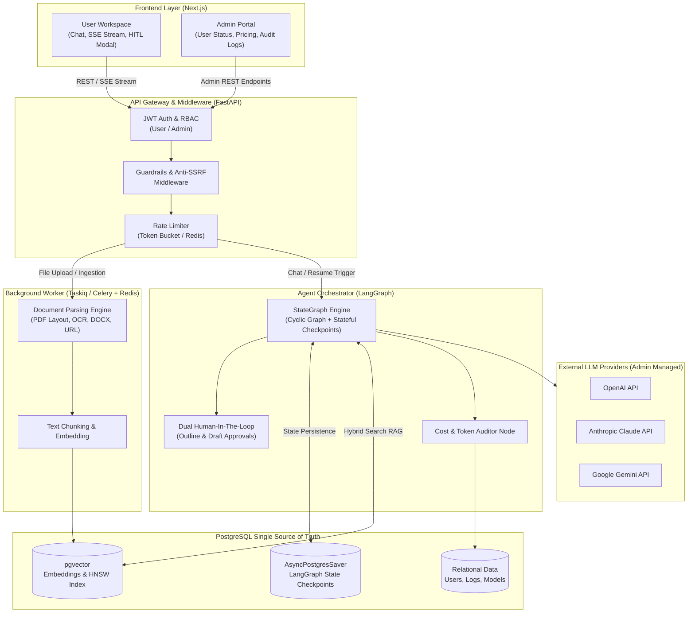
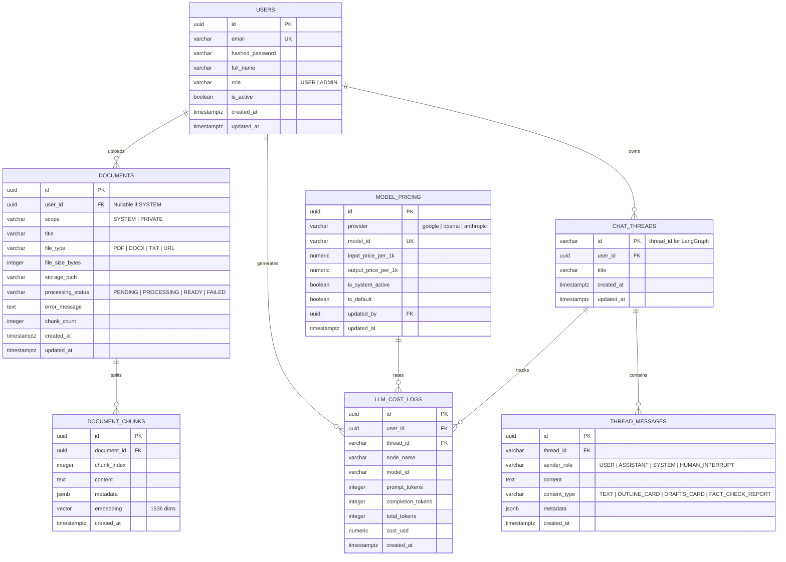
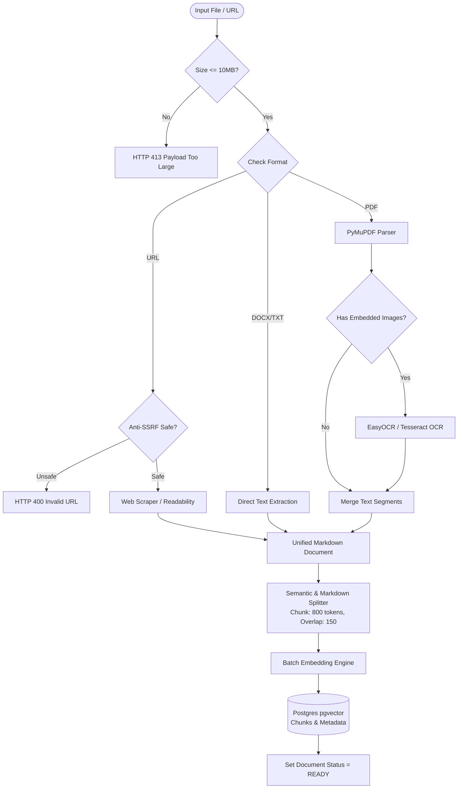
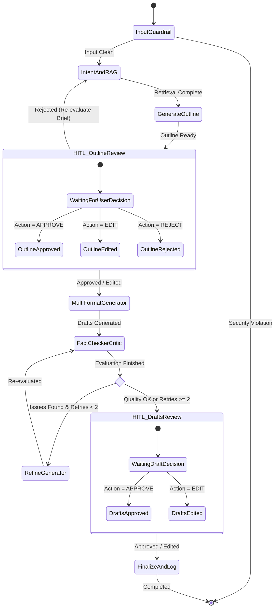
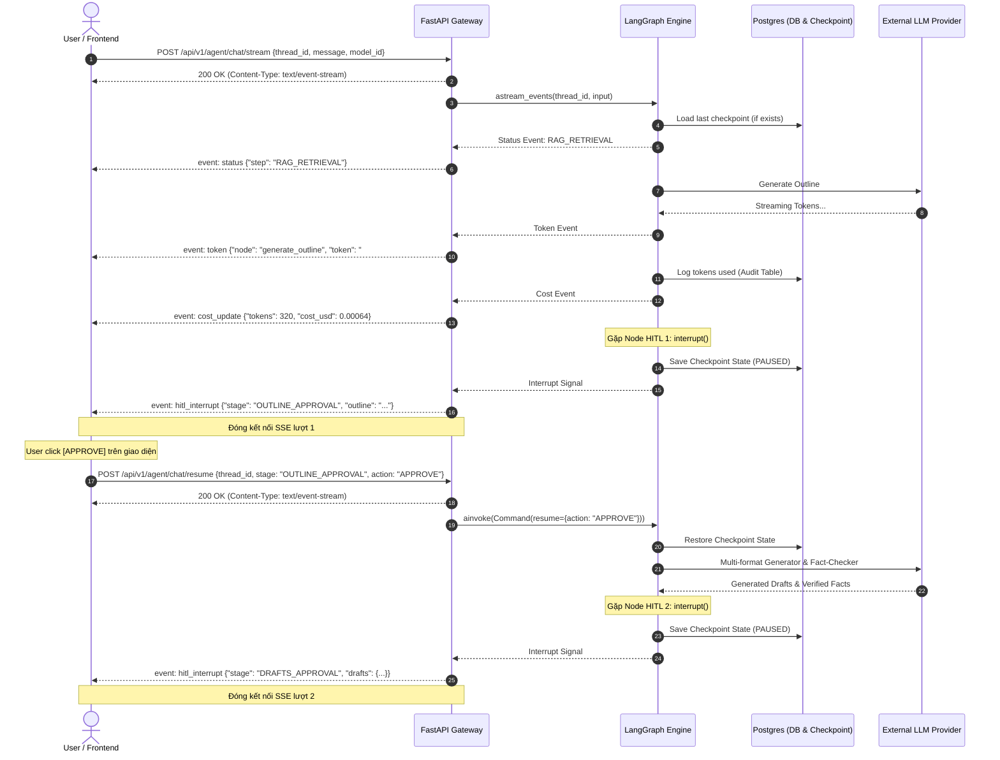
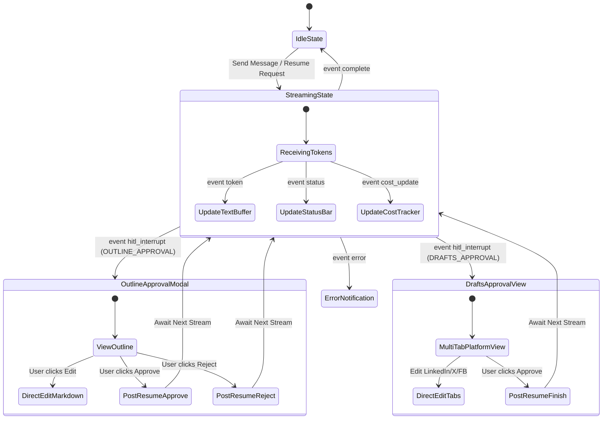

# TÀI LIỆU ĐẶC TẢ KỸ THUẬT HỆ THỐNG (SYSTEM SPECIFICATION)

## Dự án: Multi-Platform Marketing Engine & Fact-Checker AI Agent

**Kiến trúc:** FastAPI + LangGraph + PostgreSQL (Hybrid DB & Vector) + Worker Queue + Server-Sent Events (SSE)  

---

## 1. TỔNG QUAN KIẾN TRÚC HỆ THỐNG (HIGH-LEVEL ARCHITECTURE)



---

## 2. THIẾT KẾ CƠ SỞ DỮ LIỆU (DATABASE SCHEMA & DATA MODELS)

Hệ thống sử dụng **PostgreSQL** kết hợp extension `pgvector`. Bỏ qua cột `credit_balance`, giữ nguyên các chỉ số thống kê token và ước tính chi phí USD thực tế phục vụ quản trị.

### 2.1. Sơ đồ Quan hệ Thực thể (Entity Relationship Diagram)



### 2.2. Chi tiết DDL SQL chính

```sql
CREATE EXTENSION IF NOT EXISTS vector;
CREATE EXTENSION IF NOT EXISTS "uuid-ossp";

-- 1. Bảng Users (Không quản lý credit balance)
CREATE TABLE users (
    id UUID PRIMARY KEY DEFAULT gen_random_uuid(),
    email VARCHAR(255) UNIQUE NOT NULL,
    hashed_password VARCHAR(255) NOT NULL,
    full_name VARCHAR(100),
    role VARCHAR(20) NOT NULL DEFAULT 'USER' CHECK (role IN ('USER', 'ADMIN')),
    is_active BOOLEAN NOT NULL DEFAULT TRUE,
    created_at TIMESTAMPTZ DEFAULT NOW(),
    updated_at TIMESTAMPTZ DEFAULT NOW()
);

CREATE INDEX idx_users_email ON users(email);

-- 2. Bảng Model Pricing (Bảng giá tham chiếu để audit chi phí)
CREATE TABLE model_pricing (
    id UUID PRIMARY KEY DEFAULT gen_random_uuid(),
    provider VARCHAR(50) NOT NULL CHECK (provider IN ('google', 'openai', 'anthropic')),
    model_id VARCHAR(100) UNIQUE NOT NULL,
    input_price_per_1k NUMERIC(10, 6) NOT NULL,
    output_price_per_1k NUMERIC(10, 6) NOT NULL,
    is_system_active BOOLEAN NOT NULL DEFAULT TRUE,
    is_default BOOLEAN NOT NULL DEFAULT FALSE,
    updated_by UUID REFERENCES users(id),
    updated_at TIMESTAMPTZ DEFAULT NOW()
);

-- 3. Bảng Documents & Chunks
CREATE TABLE documents (
    id UUID PRIMARY KEY DEFAULT gen_random_uuid(),
    user_id UUID REFERENCES users(id) ON DELETE CASCADE, -- NULL nếu là tài liệu dùng chung (SYSTEM)
    scope VARCHAR(20) NOT NULL CHECK (scope IN ('SYSTEM', 'PRIVATE')),
    title VARCHAR(255) NOT NULL,
    file_type VARCHAR(20) NOT NULL CHECK (file_type IN ('PDF', 'DOCX', 'TXT', 'URL')),
    file_size_bytes INTEGER CHECK (file_size_bytes <= 10485760), -- Tối đa 10MB
    storage_path VARCHAR(500),
    processing_status VARCHAR(20) NOT NULL DEFAULT 'PENDING' CHECK (processing_status IN ('PENDING', 'PROCESSING', 'READY', 'FAILED')),
    error_message TEXT,
    chunk_count INTEGER DEFAULT 0,
    created_at TIMESTAMPTZ DEFAULT NOW(),
    updated_at TIMESTAMPTZ DEFAULT NOW()
);

CREATE INDEX idx_documents_user_scope ON documents(user_id, scope);

CREATE TABLE document_chunks (
    id UUID PRIMARY KEY DEFAULT gen_random_uuid(),
    document_id UUID NOT NULL REFERENCES documents(id) ON DELETE CASCADE,
    chunk_index INTEGER NOT NULL,
    content TEXT NOT NULL,
    metadata JSONB DEFAULT '{}'::jsonb,
    embedding vector(1536),
    created_at TIMESTAMPTZ DEFAULT NOW()
);

CREATE INDEX idx_document_chunks_embedding 
ON document_chunks USING hnsw (embedding vector_cosine_ops)
WITH (m = 16, ef_construction = 64);

CREATE INDEX idx_document_chunks_fts ON document_chunks USING gin(to_tsvector('simple', content));

-- 4. Bảng Chat Threads & Messages
CREATE TABLE chat_threads (
    id VARCHAR(100) PRIMARY KEY, -- Maps directly to thread_id in LangGraph
    user_id UUID NOT NULL REFERENCES users(id) ON DELETE CASCADE,
    title VARCHAR(255) DEFAULT 'Chiến dịch mới',
    created_at TIMESTAMPTZ DEFAULT NOW(),
    updated_at TIMESTAMPTZ DEFAULT NOW()
);

CREATE INDEX idx_chat_threads_user ON chat_threads(user_id);

CREATE TABLE thread_messages (
    id UUID PRIMARY KEY DEFAULT gen_random_uuid(),
    thread_id VARCHAR(100) NOT NULL REFERENCES chat_threads(id) ON DELETE CASCADE,
    sender_role VARCHAR(20) NOT NULL CHECK (sender_role IN ('USER', 'ASSISTANT', 'SYSTEM', 'HUMAN_INTERRUPT')),
    content TEXT NOT NULL,
    content_type VARCHAR(20) NOT NULL DEFAULT 'TEXT' CHECK (content_type IN ('TEXT', 'OUTLINE_CARD', 'DRAFTS_CARD', 'FACT_CHECK_REPORT')),
    metadata JSONB DEFAULT '{}'::jsonb,
    created_at TIMESTAMPTZ DEFAULT NOW()
);

CREATE INDEX idx_thread_messages_thread ON thread_messages(thread_id, created_at);

-- 5. Bảng Audit Log Chi Phí LLM (Ghi nhận thuần túy, không cấn trừ số dư)
CREATE TABLE llm_cost_logs (
    id UUID PRIMARY KEY DEFAULT gen_random_uuid(),
    user_id UUID NOT NULL REFERENCES users(id) ON DELETE CASCADE,
    thread_id VARCHAR(100) REFERENCES chat_threads(id) ON DELETE SET NULL,
    node_name VARCHAR(50) NOT NULL,
    model_id VARCHAR(100) NOT NULL,
    prompt_tokens INTEGER NOT NULL,
    completion_tokens INTEGER NOT NULL,
    total_tokens INTEGER NOT NULL,
    cost_usd NUMERIC(10, 6) NOT NULL,
    created_at TIMESTAMPTZ DEFAULT NOW()
);

CREATE INDEX idx_cost_logs_user_date ON llm_cost_logs(user_id, created_at);
CREATE INDEX idx_cost_logs_model ON llm_cost_logs(model_id);
```

---

## 3. RAG INGESTION PIPELINE (XỬ LÝ TÀI LIỆU, OCR & HYBRID SEARCH)



### Công thức Hybrid Retrieval (Reciprocal Rank Fusion - RRF)
Truy vấn RAG áp dụng lọc kép theo quyền:
$$\text{Scope Condition} = (\text{scope} = 'SYSTEM') \lor (\text{scope} = 'PRIVATE' \land \text{user\_id} = current\_user\_id)$$

Kết hợp Dense Vector Search và Sparse Full-text Search qua RRF:
$$RRF\_Score(d) = \frac{1}{60 + Rank_{vector}(d)} + \frac{1}{60 + Rank_{bm25}(d)}$$

Top 15 Chunks từ RRF sau đó được đưa qua Reranker (Cross-Encoder) để lấy ra Top 4 context liên quan nhất.

---

## 4. BẢO MẬT, GUARDRAILS & CHỐNG PROMPT INJECTION

```mermaid
flowchart LR
    subgraph V1["Vòng 1: Input Guardrail"]
        direction TB
        R1[Rate Limiter: 30 req/min]
        R2[Regex Jailbreak Filter]
        R3[PII Masking]
        R4[Semantic Injection Classifier]
    end

    subgraph V2["Vòng 2: Context Isolation"]
        direction TB
        C1[XML Encapsulation\nThẻ external_context]
        C2[Prompt Boundary Defense\nChỉ thị không thực thi payload context]
    end

    subgraph V3["Vòng 3: Output Guardrail"]
        direction TB
        O1[Fact-Checker Engine]
        O2[Data Leakage & Secret Scanner]
        O3[Anti-AI Cliché Filter]
    end

    UserPrompt([User Prompt]) --> V1
    V1 -->|Passed| V2
    V2 --> LLMProcessing[LLM Core Execution]
    LLMProcessing --> V3
    V3 --> FinalOutput([Stream SSE to User])

    V1 -- Blocked --> SecError[SSE Error Event]
    V3 -- Flagged --> RefineOrError[Refine Node / SSE Error]
```



---

## 5. THIẾT KẾ ĐẶC TẢ LANGGRAPH WORKFLOW VỚI DUAL-HITL

### 5.1. Sơ đồ Luồng Trạng Thái (StateGraph Transition)



### 5.2. Định nghĩa State Schema & Code các Node chính

```python
from typing import Annotated, Dict, List, Optional, Any
from typing_extensions import TypedDict
from langgraph.graph.message import add_messages
from langgraph.types import interrupt

class AgentState(TypedDict):
    thread_id: str
    user_id: str
    selected_model: str
    messages: Annotated[list, add_messages]
    
    # Brief & RAG Context
    campaign_topic: str
    retrieved_rag_context: List[str]
    web_search_context: List[str]
    
    # HITL 1: Dàn ý
    outline: Optional[str]
    outline_status: Optional[str]  # "approved", "edited", "rejected"
    
    # Bản thảo đa kênh
    drafts: Dict[str, str]  # {"linkedin": "...", "twitter": "...", "facebook": "..."}
    
    # Fact-checking & Self-Correction
    fact_check_passed: bool
    fact_check_report: Optional[str]
    retry_count: int
    
    # HITL 2: Bản thảo cuối
    drafts_status: Optional[str]

def hitl_approve_outline_node(state: AgentState):
    """Điểm ngắt số 1: Tạm dừng để duyệt dàn ý"""
    user_decision: Dict[str, Any] = interrupt({
        "stage": "OUTLINE_APPROVAL",
        "message": "Dàn ý chiến dịch đã sẵn sàng. Vui lòng kiểm tra và duyệt.",
        "outline": state["outline"]
    })
    
    action = user_decision.get("action")
    if action == "edit":
        return {
            "outline": user_decision.get("updated_outline", state["outline"]),
            "outline_status": "edited"
        }
    elif action == "reject":
        return {
            "outline_status": "rejected",
            "campaign_topic": user_decision.get("feedback", state["campaign_topic"])
        }
    return {"outline_status": "approved"}

def hitl_approve_drafts_node(state: AgentState):
    """Điểm ngắt số 2: Tạm dừng để duyệt bản thảo đa kênh"""
    user_decision: Dict[str, Any] = interrupt({
        "stage": "DRAFTS_APPROVAL",
        "message": "Bản thảo đã qua bước Fact-checking. Bạn có muốn duyệt hoặc tinh chỉnh?",
        "drafts": state["drafts"],
        "fact_check_report": state.get("fact_check_report")
    })
    
    action = user_decision.get("action")
    if action == "edit":
        return {
            "drafts": user_decision.get("updated_drafts", state["drafts"]),
            "drafts_status": "edited"
        }
    return {"drafts_status": "approved"}
```

---

## 6. GIAO THỨC SERVER-SENT EVENTS (SSE) & SEQUENCE TRACE

### 6.1. Sequence Diagram luồng Streaming và Dual-HITL



### 6.2. Danh mục Event Payload SSE (W3C Standard)

| Event Type | Khi nào gửi? | Cấu trúc Payload (`data`) |
| :--- | :--- | :--- |
| `status` | Agent chuyển node hoặc đang truy vấn RAG | `{"step": "FACT_CHECKING", "message": "Đang đối soát số liệu..."}` |
| `token` | Stream từng chunk text sinh ra | `{"node": "generate_outline", "token": "Tiếp cận"}` |
| `cost_update`| Thông báo số token và chi phí USD đã hạch toán | `{"node": "multi_format_generator", "tokens": 1250, "cost_usd": 0.0025}` |
| `hitl_interrupt` | **Đồ thị tạm dừng**. Chờ người dùng can thiệp | `{"stage": "OUTLINE_APPROVAL", "data": {"outline": "..."}}` |
| `error` | Vi phạm Guardrail hoặc lỗi hệ thống | `{"code": "GUARDRAIL_VIOLATION", "message": "Nội dung vi phạm chính sách."}` |
| `complete` | Toàn bộ chu trình hoàn tất | `{"thread_id": "thread_123", "status": "FINISHED"}` |

---

## 7. CHI TIẾT API CONTRACTS (FASTAPI SPECIFICATION)

### 7.1. Phân hệ Admin (`/api/v1/admin`) — Yêu cầu `role: ADMIN`

#### `PATCH /api/v1/admin/users/{user_id}/status`
*   **Mục đích:** Kích hoạt hoặc vô hiệu hóa tài khoản người dùng.
*   **Request Body:**
    ```json
    {
      "is_active": false
    }
    ```
*   **Response (200 OK):**
    ```json
    {
      "user_id": "01943b12-9c3a-7a8e-b5c1-123456789abc",
      "is_active": false,
      "message": "User status updated successfully"
    }
    ```

#### `GET /api/v1/admin/pricing`
*   **Mục đích:** Liệt kê bảng giá token của các model đang được hệ thống hỗ trợ.
*   **Response (200 OK):**
    ```json
    [
      {
        "provider": "anthropic",
        "model_id": "claude-3-7-sonnet",
        "input_price_per_1k": 0.003,
        "output_price_per_1k": 0.015,
        "is_system_active": true,
        "is_default": true
      },
      {
        "provider": "openai",
        "model_id": "gpt-4o",
        "input_price_per_1k": 0.0025,
        "output_price_per_1k": 0.010,
        "is_system_active": true,
        "is_default": false
      },
      {
        "provider": "google",
        "model_id": "gemini-2.5-flash",
        "input_price_per_1k": 0.00015,
        "output_price_per_1k": 0.0006,
        "is_system_active": true,
        "is_default": false
      }
    ]
    ```

#### `PUT /api/v1/admin/pricing/{model_id}`
*   **Mục đích:** Cập nhật đơn giá hoặc trạng thái kích hoạt của model.
*   **Request Body:**
    ```json
    {
      "input_price_per_1k": 0.003,
      "output_price_per_1k": 0.015,
      "is_system_active": true,
      "is_default": true
    }
    ```

#### `GET /api/v1/admin/analytics/costs`
*   **Mục đích:** Xem báo cáo thống kê tổng token và chi phí phát sinh.
*   **Query Parameters:** `start_date`, `end_date`, `user_id`, `model_id`
*   **Response (200 OK):**
    ```json
    {
      "total_tokens_consumed": 2548900,
      "total_cost_usd": 12.4562,
      "breakdown_by_model": [
        {"model_id": "claude-3-7-sonnet", "tokens": 1800000, "cost_usd": 10.25},
        {"model_id": "gemini-2.5-flash", "tokens": 748900, "cost_usd": 2.2062}
      ],
      "breakdown_by_node": [
        {"node_name": "multi_format_generator", "tokens": 1500000, "cost_usd": 7.50},
        {"node_name": "fact_checker", "tokens": 600000, "cost_usd": 3.10},
        {"node_name": "generate_outline", "tokens": 448900, "cost_usd": 1.8562}
      ]
    }
    ```

#### `DELETE /api/v1/admin/documents/{document_id}`
*   **Mục đích:** Admin xóa bất kỳ tài liệu RAG nào trong hệ thống (kể cả tài liệu riêng của User).

---

### 7.2. Phân hệ Tài liệu RAG (`/api/v1/documents`)

#### `POST /api/v1/documents/upload`
*   **Headers:** `Authorization: Bearer <token>`, `Content-Type: multipart/form-data`
*   **Form Data:**
    *   `file`: File nhị phân (PDF, DOCX, TXT - Dung lượng <= 10MB) - *Tùy chọn nếu dùng URL*
    *   `url`: Chuỗi đường dẫn (Nếu cào từ web) - *Tùy chọn nếu dùng File*
    *   `scope`: `"PRIVATE"` (Mặc định cho User) hoặc `"SYSTEM"` (Chỉ cho phép nếu User có `role: ADMIN`)
*   **Response (202 Accepted):**
    ```json
    {
      "document_id": "01943b12-9c3a-7a8e-b5c1-123456789abc",
      "title": "Huong_dan_thuong_hieu.pdf",
      "file_type": "PDF",
      "file_size_bytes": 4821940,
      "scope": "SYSTEM",
      "status": "PROCESSING",
      "message": "File đã được tiếp nhận và đang trích xuất nội dung ngầm."
    }
    ```

---

### 7.3. Phân hệ Chat & Streaming SSE (`/api/v1/agent`)

#### `POST /api/v1/agent/chat/stream`
*   **Request Body:**
    ```json
    {
      "thread_id": "camp_b2b_launch_2026",
      "message": "Lên chiến dịch truyền thông đa kênh cho giải pháp FinTech mới",
      "model_id": "claude-3-7-sonnet"
    }
    ```
*   **Headers:** `Accept: text/event-stream`
*   **Response:** `StreamingResponse (HTTP 200, text/event-stream)`

#### `POST /api/v1/agent/chat/resume`
*   **Request Body:**
    ```json
    {
      "thread_id": "camp_b2b_launch_2026",
      "stage": "OUTLINE_APPROVAL",
      "action": "APPROVE", 
      "updated_outline": null,
      "feedback": null
    }
    ```
    *(Đối với `action: "EDIT"`, truyền chuỗi markdown mới vào `updated_outline` hoặc dict vào `updated_drafts`).*
*   **Headers:** `Accept: text/event-stream`
*   **Response:** `StreamingResponse (HTTP 200, text/event-stream)`

---

## 8. HƯỚNG DẪN KỸ THUẬT DÀNH CHO FRONTEND (FE GUIDELINES)



### Yêu cầu triển khai chi tiết:
1.  **Client SSE Management:**
    *   Sử dụng thư viện `@microsoft/fetch-event-source` thay thế cho native `EventSource` để hỗ trợ custom HTTP headers (`Authorization`) và gửi body method `POST`.
2.  **Quản lý HITL Interruption:**
    *   Khi bắt được `event: hitl_interrupt` với `stage: "OUTLINE_APPROVAL"`, mở modal phê duyệt dàn ý. Cung cấp 3 nút bấm tương ứng: `Approve`, `Edit inline` (mở editor Markdown), và `Reject` (kèm input nhập lý do).
    *   Khi bắt được `event: hitl_interrupt` với `stage: "DRAFTS_APPROVAL"`, chuyển màn hình sang giao diện 3 Tab (LinkedIn, X Thread, Facebook). Bên cạnh hiển thị danh sách Fact-Check đã pass/fail để người dùng đối chiếu trước khi bấm chốt.
3.  **Realtime Cost & Token Bar:**
    *   Mỗi khi nhận `event: cost_update`, cộng dồn số tokens và tổng chi phí USD ước tính của session hiện tại lên góc trên thanh trạng thái chat.

---